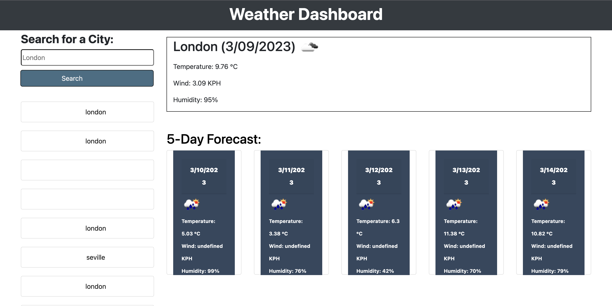

# PerezSanzDaniel_WeatherDashboard

Challenge Week 8: Weather Dashboard

## Description 

In this project I introduce a real-world application to JavaScript and Server APIs. The aim is to build a real weather dashboard. You can see a demo [here](https://danielpsnz.github.io/PerezSanzDaniel_WeatherDashboard/).

## Usage 

The portfolio should be seen as below: 

## Credits

[Daniel Pérez](https://github.com/danielpsnz)

## License

The license used is MIT License. Here is more information about it. 

[https://github.com/danielpsnz/PerezSanzDaniel_CodeQuiz/blob/main/LICENSE)
